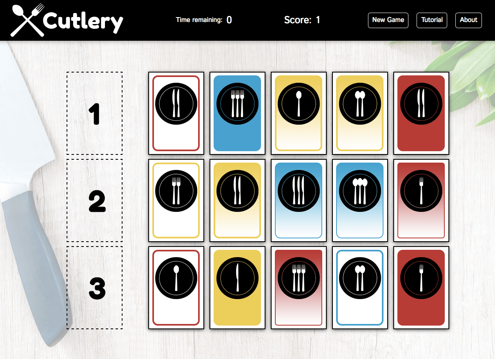

# Cutlery - Browser-based Javascript card game based on SET

[Cutlery live link](https://karmapoint.github.io/Cutlery/)

**Cutlery** is a simple JavaScript game based on [Set](http://bit.ly/2nm7FtW), an award-winning pattern recognition card game.

The goal is to identify sets of 3 cards where each of four attributes are either all the same, or all different.

I used Forks, Spoons, and Knives to give the game a fun spin. Here are all of the available attributes in the deck of 81 original cards (which I designed in photoshop):

* Shape (fork, spoon, knife)
* Color (red, yellow, blue)
* Shading (solid, outline, pattern)
* Number (one, two, three)

## Functionality

* Users can drag and drop cards to the target area of the screen to identify a set. I utilized a small drag and drop JavaScript library called [Dragula](https://bevacqua.github.io/dragula/) to quickly implement the dragging and dropping and touch enablement.  

* The game does work on mobile and tablet devices, although the interface (nav menu and modals) has not been optimized for those mediums at this time.

* A timer provides a sense of urgency to the game play. It is set to 60 seconds and counts down until it reaches zero, or the player identifies a set, which will reset the counter to 60. The timer utilizes setInterval to tick down and has pause and reset functions.

* I added a short tutorial modal to teach players the basics of the game. I created my own modals with CSS and JavaScript which I used for a tutorial, an about screen, and notifications about successfully finding a set, submitting an incorrect set, and completing a game.

## Sample Code

#### Drag and drop implementation
```
let drake = dragula({
  isContainer: (el) => {
    return el.classList.contains('card_start') ||
    el.classList.contains('target');
  }
}).on('drop',
  (el) => {
  potentialAttributes.push(el.className.slice(0, el.className.length - 11));
  setTimeout(() => {checkForSet(potentialAttributes);},100);
}
);
```

#### Checking for sets
I found a way to strip the attributes of a card from the card's class. Then I made an array of the 12 attributes (4 each from 3 cards).  I used Lodash to get counts for each individual attribute. Since card attributes must all be the same or all different, I realized if the count of any attribute totaled 2 that it would not be a set.

```
  const countAttributes = (items) => {
    let counts = _.countBy(items, _.identity);
    return !_.values(counts).includes(2);
  };
```

## Technologies:
 * HTML - Single page
 * CSS - Flexbox display
 * JavaScript - Functionality
 * jQuery - Assisted with some DOM manipulation
 * Webpack - Consolidated my production JavaScript files
 * Babel - Made code ES5 compatible.
 * Dragula - Drag and drop functionality
 * Lodash - Used to save time on some array methods
 * Photoshop - designed logo and cards


## View
Cutlery is a single page app. There is a header that stretches across the top of the screen at all times. It displays the logo  in the upper left corner. Simple navigation links appear on the right side. The center of the header is devoted to the timer and the score.

The main content area of the screen is taken up by the board of 15 cards.  There is a column on the far left of the screen displaying the three target areas where cards can be dropped to make a set.  




## Future Improvements

* Save and display high score with local storage
* Easy mode for improving the learning curve of the game itself.
* Levels where the deck is shuffled and new cards are displayed after finding x sets.  The timer can be reduced to increase difficulty.
