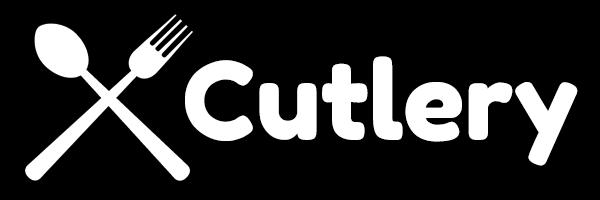
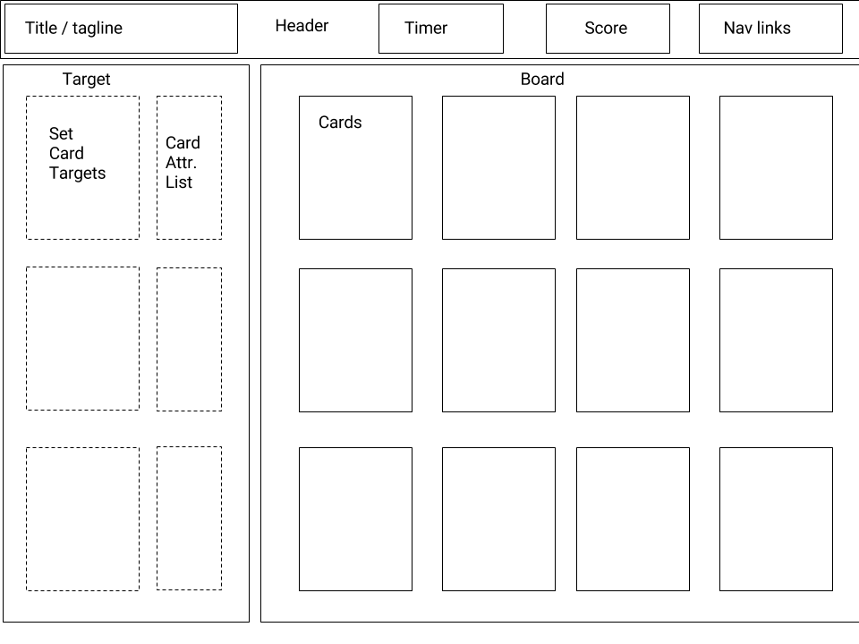

# Cutlery - Browser-based Javascript card game based on SET

## Background

[Set](http://bit.ly/2nm7FtW) is an award-winning pattern recognition card game where players try to identify "sets" of three cards that meet a set of rules. Cutlery will utilize the basic premise of the game and create a version that is easy to play on web browsers (and hopefully tablets as well).

The deck is comprised of 81 unique cards that have four attributes:

 * Shape (fork, spoon, knife)
 * Color (red, yellow, blue)
 * Shading (solid, outline, pattern)
 * Number (one, two, three)

 Game play involves shuffling the deck and dealing out 12 cards. The player will need to select three cards that they feel make up a "set" into the three target slots on the side of the screen. A set requires that the three cards meet one of the following conditions:

 * All the same, or all different for shape.
 * All the same, or all different for color.
 * All the same, or all different for shading.
 * All the same, or all different for number.

The player will have a timer counting down from 1 minute to find a set. If they do this successfully, the selected cards are removed and three more are added to the board to replace them and the counter resets.  A score will tally how many sets they are able to make.

Should no sets be visible on the board, the cards will automatically be shuffled and restarted.

## Functionality & MVP

The set of initial features for this minimum viable product include the following:

* Users can drag and drop cards to the target area of the screen to identify a set.
* A timer will provide a sense of urgency to the game play. A bonus feature may involve creating levels where the duration of the timer is shortened each time.
* A quick tutorial will introduce the rules of the game. Another bonus feature would be an "easy" mode where there are only 9 cards visible, but all of them are solid colors to make it easier to spot. After finding two sets, users would be directed to the main game play.

* A production readme will describe the creation process and coding decisions.

## View
Cutlery will be a single page app. There will be a header that stretches across the top of the screen at all times. It will display the logo (and possibly tagline) in the upper left corner. Simple navigation links will appear on the right side. The center of the header will be devoted to the timer and the score.

The main content area of the screen will be mostly taken up by the board of 12 cards.  There will be a column on the far left of the screen displaying the three target areas where cards can be dropped to make a set.  Next to the targets will be a small area where the attributes of the targeted card will be displayed in text. (This may be scratched depending on usability needs and aesthetics).

## Architecture

* Vanilla JavaScript for primary logic.
* React.js as a framework for a single page web app.
* Dragula for touch-friendly drag and drop (they have a React version available)
* Webpack and Babel for bundling the assorted scripts.

The app will be composed of the following files/components:

* Header
  * Title
  * Timer
  * Score
  * Nav
* Content
  * Target
    * Dropzone (3)
  * Board
    * Cell (16)
  * Tutorial (possibly modal)
  * About (possibly modal)
* Deck
  * Card (81)

## Timeline

### Day 1
  * Setup project folders, webpack, and get a basic React.js single page app set up with the header and content area.

### Day 2
  * Create deck and cards. Learn drag and drop. Have data start to pass back and forth between components.

### Day 3
  * Build out game logic, scoring, and timer.

### Day 4
  * Implement tutorial and other fine tuning.

### BONUS
  * Easy mode
  * Progressing levels

  ----
### Cards:

#### Blue
- 1 Fork, solid
- 1 Fork, pattern
- 1 Fork, outline
- 2 Fork, solid
- 2 Fork, pattern
- 2 Fork, outline
- 3 Fork, solid
- 3 Fork, pattern
- 3 Fork, outline
- 1 Spoon, solid
- 1 Spoon, pattern
- 1 Spoon, outline
- 2 Spoon, solid
- 2 Spoon, pattern
- 2 Spoon, outline
- 3 Spoon, solid
- 3 Spoon, pattern
- 3 Spoon, outline
- 1 Knife, solid
- 1 Knife, pattern
- 1 Knife, outline
- 2 Knife, solid
- 2 Knife, pattern
- 2 Knife, outline
- 3 Knife, solid
- 3 Knife, pattern
- 3 Knife, outline

#### Red
- 1 Fork, solid
- 1 Fork, pattern
- 1 Fork, outline
- 2 Fork, solid
- 2 Fork, pattern
- 2 Fork, outline
- 3 Fork, solid
- 3 Fork, pattern
- 3 Fork, outline
- 1 Spoon, solid
- 1 Spoon, pattern
- 1 Spoon, outline
- 2 Spoon, solid
- 2 Spoon, pattern
- 2 Spoon, outline
- 3 Spoon, solid
- 3 Spoon, pattern
- 3 Spoon, outline
- 1 Knife, solid
- 1 Knife, pattern
- 1 Knife, outline
- 2 Knife, solid
- 2 Knife, pattern
- 2 Knife, outline
- 3 Knife, solid
- 3 Knife, pattern
- 3 Knife, outline

#### Yellow
- 1 Fork, solid
- 1 Fork, pattern
- 1 Fork, outline
- 2 Fork, solid
- 2 Fork, pattern
- 2 Fork, outline
- 3 Fork, solid
- 3 Fork, pattern
- 3 Fork, outline
- 1 Spoon, solid
- 1 Spoon, pattern
- 1 Spoon, outline
- 2 Spoon, solid
- 2 Spoon, pattern
- 2 Spoon, outline
- 3 Spoon, solid
- 3 Spoon, pattern
- 3 Spoon, outline
- 1 Knife, solid
- 1 Knife, pattern
- 1 Knife, outline
- 2 Knife, solid
- 2 Knife, pattern
- 2 Knife, outline
- 3 Knife, solid
- 3 Knife, pattern
- 3 Knife, outline
